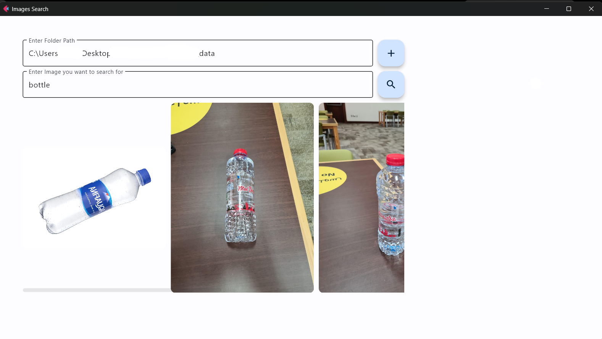

# Text-Search-Image

This project implements an image search system using CLIP (Contrastive Language-Image Pre-training) model. It allows users to search for images using natural language queries.

## Features

- Load and process images from a specified folder
- Encode images using CLIP model
- Store image embeddings in a vector database (ChromaDB)
- Search for images using text queries
- Display search results in a user-friendly interface

## Requirements

- Python 3.9.16
- Flet: For creating the graphical user interface
- Clip Model: For generating document embeddings
- ChromaDB: For efficient storage and retrieval of vector embeddings

## Installation

1. Clone this repository:
```bash
git clone https://github.com/PongpreechaSuea/Text-Search-Image.git
cd Text-Search-Image
```

2. Create a virtual environment (optional but recommended):
```bash
python -m venv test
source test/bin/activate  # On Windows, use `test\Scripts\activate`
```

3. Install the required packages:
```bash
pip install -r requirements.txt
```

## Usage

1. Run the application:
```bash
python run.py
```

2. In the application interface:

    - Enter the path to the folder containing your images
    - Click the "Add" button to load and process the images
    - Enter a text query in the search box
    - Click the "Search" button to find matching images


## Project Structure

```
text_search_image_clip/
├── assets/
├── data/
├── src/
│   ├── config.py
│   ├── image_finder.py
│   └── image_generator.py
├── README.md
├── requirements.txt
└── run.py
```


## Example

### DATA EAMPLE

<p align="center">
  
</p>


### INTERFACE

<p align="center">
  
</p>


### RESULTS

<p align="center">
  
</p>
